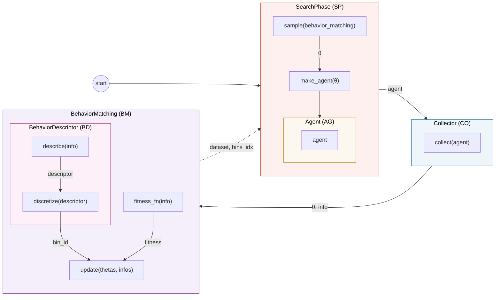
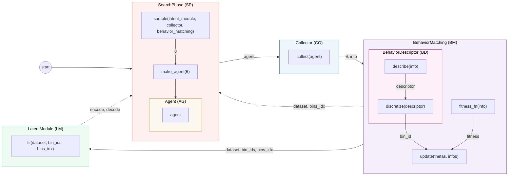
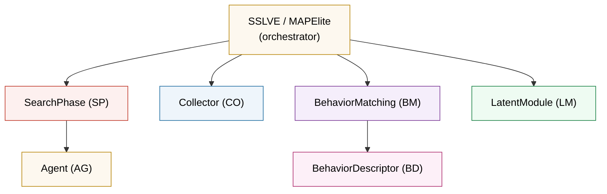

# Guideline for SSLVE

> Self-Supervised Latent Variable Evolution — Architecture Reference

---

## Contents

- [Data Flow — MAPElite](#data-flow--mapelite)
- [Data Flow — SSLVE](#data-flow--sslve)
- [Containment](#containment)
- [Core Methods](#core-methods)
- [Development Guide](#development-guide)

---

## Data Flow — MAPElite

---

## Data Flow — SSLVE

---

## Containment

---

## Core Methods

### SearchPhase (SP)

| Method | Signature | Returns |
|---|---|---|
| `sample` | `(**kwargs)` | `List[np.array]` — candidate θ vectors |
| `make_agent` | `(θ)` | `Agent` with weights set |

> Receives `latent_module`, `collector`, `behavior_matching` as kwargs. Uses or ignores depending on variant.

### Collector (CO)

| Method | Signature | Returns |
|---|---|---|
| `collect` | `(agent)` | `dict` — raw per-episode info |

### BehaviorMatching (BM)

| Method | Signature | Returns |
|---|---|---|
| `update` | `(thetas, infos)` | — |
| `coverage` | `()` | `float` |
| `fitness_stats` | `()` | `(min, mean, max)` |

**Exposed state** (read by SP and LM):

| Field | Type |
|---|---|
| `dataset` | `List[np.array]` |
| `bin_ids` | `List[bin_id]` |
| `bins_idx` | `dict{bin_id → [indices]}` |
| `fitnesses` | `List[float]` |

### LatentModule (LM)

| Method | Signature | Returns |
|---|---|---|
| `fit` | `(dataset, bin_ids, bins, ...)` | `history dict` |
| `encode` | `(x)` | `z` |
| `encode_dist` | `(x)` | `(μ, logvar)` |
| `decode` | `(z)` | `x̂` |

### Agent (AG) — supporting, inside SP

| Method | Signature | Returns |
|---|---|---|
| `set_weights` | `(flat_weights)` | — |
| `act` | `(obs)` | `action` |
| `get_weight_dim` | `()` | `int` |

### BehaviorDescriptor (BD) — supporting, inside BM

| Method | Signature | Returns |
|---|---|---|
| `describe` | `(info)` | `descriptor` |
| `discretize` | `(descriptor)` | `bin_id` |
| `total_bins` | `()` | `int` |

---

## Development Guide

### ① New task environment

| # | What to implement | Key methods |
|---|---|---|
| 1 | New **Collector (CO)** | `collect(agent) → info dict` |
| 2 | New **BehaviorDescriptor (BD)** | `describe(info)`, `discretize()`, `total_bins()` |
| 3 | New **Agent (AG)** *(if needed)* | `set_weights()`, `act()`, `get_weight_dim()` |

SP, BM, LM remain unchanged.

### ② New search / evolution method

| # | What to implement | Key methods |
|---|---|---|
| 1 | New **SearchPhase (SP)** | `sample(**kwargs)`, `make_agent(θ)` |

Must accept `latent_module`, `collector`, `behavior_matching` as kwargs (use or ignore). All other components unchanged.

### ③ Different behavior definition (same task)

| # | What to implement | Key methods |
|---|---|---|
| 1 | New **BehaviorDescriptor (BD)** | `describe(info)`, `discretize()`, `total_bins()` |

Same Collector (same info dict), just different BD extraction/discretization. Pass to BM constructor.

### ④ Different behavior matching / binning

| # | What to implement | Key methods |
|---|---|---|
| 1 | New **BehaviorMatching (BM)** | `update(thetas, infos)` |

Must expose `dataset`, `bin_ids`, `bins_idx`, `fitnesses`, `bins` for SP and LM to read. Contains a BD instance.
